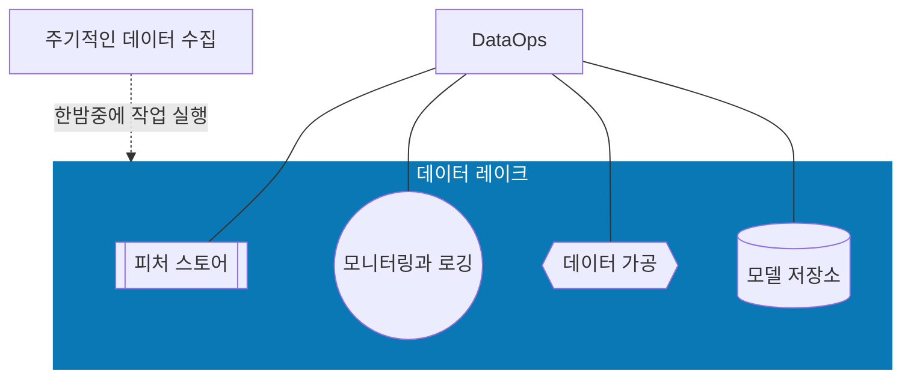

# Chapter 1 — Introduction to MLOps

> 📖 이론/개념 소개 챕터 — 실습 코드 없이 학습 노트만 작성합니다.

---

## 🗺 MLOps 전체 그림

DevOps → 자동화 → 플랫폼 자동화 → 머신러닝 시스템 자동화

하위 단계가 탄탄해야 상위 단계로 올라갈 수 있다. (욕구 단계 이론)

---

## 🛠 주요 도구 생태계

**클라우드 ML 플랫폼**

- AWS SageMaker, Azure ML Studio, GCP AI Platform

**컨테이너 / 오케스트레이션**

- Docker, Kubernetes, 프라이빗/퍼블릭 컨테이너 레지스트리

**서버리스**

- AWS Lambda, AWS Athena, Google Cloud Functions, Azure Functions

**빅데이터 & 스토리지**
- AWS S3, GCS, Databri
cks, Hadoop/Spark, Snowflake, BigQuery

**특화 하드웨어**

- GPU, Google TPU, Apple A14

---

## 핵심 개념

### CI (지속적 통합)

지속적 테스트를 통해 소프트웨어 품질을 자동으로 향상시키는 프로세스

- 소스 코드를 저장소에 병합할 때마다 자동으로 테스트 실행
- 도구: GitHub Actions, Jenkins, GitLab, CircleCI, AWS CodeBuild

### CD (지속적 배포)

사람의 개입 없이 새로운 환경에 코드를 자동으로 전달하는 프로세스

- IaC를 활용해 스테이징/프로덕션 환경에 자동 배포

### 마이크로서비스

의존성이 거의 없고 독립적인 기능을 가진 소프트웨어 서비스

- **FaaS**: AWS Lambda
- **CaaS**: Flask + Dockerfile → AWS Fargate, Google Cloud Run, Azure App Service

### IaC (코드형 인프라)

인프라를 소스 코드로 관리하고 배포하는 프로세스

- 멱등성 보장 — 몇 번을 실행해도 동일한 결과
- 도구: AWS CloudFormation, AWS SAM, Pulumi, Terraform

### 모니터링

프로덕션 시스템의 성능과 신뢰성을 판단하고 의사결정을 돕는 프로세스

- 도구: New Relic, Datadog, Stackdriver

- **카이젠** — 데이터를 수집하고 지속적으로 개선

---

## DevOps — 스캐폴드 구성

파이썬 프로젝트의 기본 뼈대:

| 요소 | 역할 |
|------|------|
| `Makefile` | `make lint`, `make test` 등 반복 명령 자동화 |
| `requirements.txt` | pip 패키지 관리, 환경별로 여러 개 둘 수 있음 |
| `소스 코드 + 테스트` | pytest 프레임워크로 테스트 작성 |
| `CI 서버` | make lint/test를 자동으로 실행 |

> 💡 Makefile을 쓰면 로컬과 CI 서버에서 **완전히 동일한 명령어**로 실행 가능하다.

---

## DataOps & 데이터 엔지니어링

**에어플로우**: 에어비앤비가 개발한 데이터 처리 워크플로 예약/관리/모니터링 도구

**데이터 레이크**: 중앙 집중식 저장소 — 데이터를 이동할 필요 없이 한 곳에서 처리

- 높은 내구성 + 가용성 + 무한에 가까운 확장성
- 클라우드 기반 객체 스토리지(S3, GCS)와 동의어처럼 사용

**클라우드 데이터 레이크 워크플로**

---

## 플랫폼 자동화

조직의 클라우드 환경에 맞는 ML 플랫폼을 선택하는 것이 핵심:

| 조직 환경 | 추천 플랫폼 |
|-----------|------------|
| AWS 중심 | AWS SageMaker |
| GCP 중심 | Google AI Platform |
| Azure 중심 | Azure ML Studio |
| Kubernetes 중심 | Kubeflow |

---

## 1.4.5 MLOps

> DevOps + 데이터 자동화 + 플랫폼 자동화가 모두 갖춰져야 MLOps를 다룰 자격이 생긴다.

**MLOps 피드백 루프**

- 재사용 가능한 ML 파이프라인으로 모델 생성 및 재학습
- ML 모델의 지속적 배포
- MLOps 파이프라인 추적 로그
- 모델 드리프트 모니터링

---

## ✏️ 연습해보기

- [x] Makefile, 린팅, 테스트가 포함된 GitHub 저장소 생성 → **MLOPS-PLAYGROUND**

---

## 💡 인사이트 & 의문점

- DevOps 없이 MLOps 없다 
— 기초가 탄탄해야 상위 자동화가 의미 있음
- 데이터 레이크 "무한 확장"→ 객체 스토리지의 특성 때문

---

## 🔗 참고 자료

- [paiml/practical-mlops-book](https://github.com/paiml/practical-mlops-book)